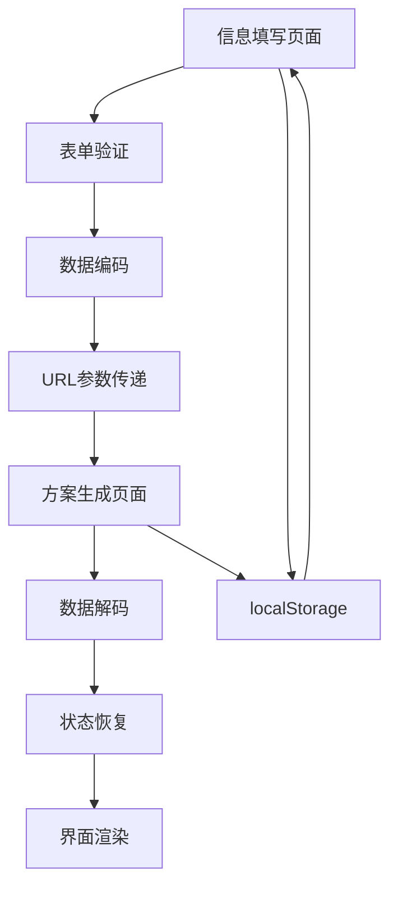

# Design Document

## Overview

本设计文档描述了如何将现有的单页面老板IP打造方案生成器重构为真正的两个独立页面应用。新项目将采用Next.js App Router架构，实现清晰的页面分离和状态管理，同时保持与原项目完全一致的用户界面和交互体验。

## Architecture

### 技术栈
- **框架**: Next.js 14+ with App Router
- **语言**: TypeScript
- **样式**: Tailwind CSS
- **UI组件**: Shadcn/ui (复用原项目组件)
- **状态管理**: URL参数 + localStorage + React Context
- **路由**: Next.js App Router

### 项目结构
```
two-page-ip-generator/
├── app/
│   ├── layout.tsx                 # 根布局
│   ├── page.tsx                   # 信息填写页面 (/)
│   └── generate/
│       └── page.tsx               # 方案生成页面 (/generate)
├── components/
│   ├── ui/                        # 基础UI组件 (复用原项目)
│   ├── form-section.tsx           # 表单组件 (复用原项目)
│   ├── page-header.tsx            # 页面头部 (复用原项目)
│   ├── progress-steps.tsx         # 进度步骤 (复用原项目)
│   ├── content-placeholder.tsx    # 内容占位符组件 (新增)
│   └── banner-placeholder.tsx     # Banner占位符组件 (新增)
├── lib/
│   ├── types.ts                   # 类型定义 (复用原项目)
│   ├── constants.ts               # 常量定义 (复用原项目)
│   ├── models.ts                  # 模型配置 (复用原项目)
│   └── form-data-manager.ts       # 表单数据管理 (新增)
├── hooks/
│   ├── use-form-data.ts           # 表单数据Hook (复用原项目)
│   └── use-form-persistence.ts    # 表单持久化Hook (新增)
└── context/
    └── form-context.tsx           # 表单上下文 (新增)
```

## Components and Interfaces

### 1. 页面组件

#### 信息填写页面 (`app/page.tsx`)
```typescript
interface FormPageProps {}

export default function FormPage(): JSX.Element
```

**职责**:
- 渲染信息填写表单
- 处理表单验证
- 管理表单状态
- 处理页面跳转

**主要功能**:
- 显示与原项目完全相同的表单界面
- 实现表单验证逻辑
- 处理"生成专业方案"按钮点击
- 跳转到方案生成页面并传递数据

#### 方案生成页面 (`app/generate/page.tsx`)
```typescript
interface GeneratePageProps {
  searchParams: { [key: string]: string | string[] | undefined }
}

export default function GeneratePage({ searchParams }: GeneratePageProps): JSX.Element
```

**职责**:
- 显示方案生成界面
- 渲染占位符内容
- 处理返回操作
- 管理页面状态

**主要功能**:
- 显示与原项目相同的操作栏和布局
- 在banner区域显示占位符
- 在内容区域显示占位符
- 处理"修改信息"按钮返回功能

### 2. 核心组件

#### FormSection组件 (复用原项目)
```typescript
interface FormSectionProps {
  formData: FormData
  onInputChange: (field: string, value: string) => void
  expandedKeywords: ExpandedKeywords | null
  isExpandingKeywords: boolean
  selectedModelId: string
  onModelChange: (modelId: string) => void
  showModelSettings: boolean
  onToggleModelSettings: () => void
  isLoading: boolean
  error: string
  onSubmit: () => void
  setFormData?: (data: FormData) => void
  setExpandedKeywords?: (keywords: ExpandedKeywords | null) => void
  setIsExpandingKeywords?: (loading: boolean) => void
}
```

#### BannerPlaceholder组件 (新增)
```typescript
interface BannerPlaceholderProps {
  storeName?: string
  className?: string
}

export function BannerPlaceholder({ storeName, className }: BannerPlaceholderProps): JSX.Element
```

**职责**:
- 显示banner区域的占位符
- 保持与原项目相同的尺寸和布局
- 显示适当的占位符文本

#### ContentPlaceholder组件 (新增)
```typescript
interface ContentPlaceholderProps {
  className?: string
}

export function ContentPlaceholder({ className }: ContentPlaceholderProps): JSX.Element
```

**职责**:
- 显示内容区域的占位符
- 保持与原项目相同的布局结构
- 显示适当的占位符文本

### 3. 状态管理组件

#### FormContext (新增)
```typescript
interface FormContextType {
  formData: FormData
  setFormData: (data: FormData) => void
  updateField: (field: string, value: string) => void
  resetForm: () => void
  isValid: boolean
  errors: Record<string, string>
}

export const FormContext = createContext<FormContextType | undefined>(undefined)
export function FormProvider({ children }: { children: React.ReactNode }): JSX.Element
export function useFormContext(): FormContextType
```

#### FormDataManager (新增)
```typescript
export class FormDataManager {
  static saveToStorage(data: FormData): void
  static loadFromStorage(): FormData | null
  static clearStorage(): void
  static encodeForUrl(data: FormData): string
  static decodeFromUrl(encoded: string): FormData | null
  static validateFormData(data: FormData): { isValid: boolean; errors: Record<string, string> }
}
```

## Data Models

### FormData接口 (复用原项目)
```typescript
interface FormData {
  storeName: string
  storeCategory: string
  storeLocation: string
  businessDuration: string
  storeFeatures: string
  ownerName: string
  ownerFeatures: string
  storeType?: string
  targetAudience?: string
  businessGoals?: string
}
```

### 数据传递策略
1. **URL参数**: 用于页面间数据传递
2. **localStorage**: 用于数据持久化
3. **React Context**: 用于组件间状态共享

### 数据流设计


## Error Handling

### 表单验证错误
- **必填字段验证**: 检查所有必填字段是否已填写
- **字段格式验证**: 验证字段内容格式是否正确
- **实时验证**: 在用户输入时提供即时反馈

### 页面跳转错误
- **数据丢失处理**: 当URL参数缺失时从localStorage恢复
- **数据损坏处理**: 当数据解析失败时显示错误提示
- **网络错误处理**: 处理页面加载失败的情况

### 错误处理策略
```typescript
interface ErrorBoundaryState {
  hasError: boolean
  error?: Error
  errorInfo?: ErrorInfo
}

export class FormErrorBoundary extends Component<Props, ErrorBoundaryState> {
  // 错误边界实现
}
```

## Testing Strategy

### 单元测试
- **组件测试**: 测试所有新增和修改的组件
- **工具函数测试**: 测试FormDataManager等工具类
- **Hook测试**: 测试自定义Hook的功能

### 集成测试
- **页面跳转测试**: 测试页面间的数据传递
- **表单提交测试**: 测试完整的表单提交流程
- **数据持久化测试**: 测试localStorage的读写功能

### 端到端测试
- **用户流程测试**: 测试完整的用户操作流程
- **响应式测试**: 测试不同屏幕尺寸下的表现
- **浏览器兼容性测试**: 测试主流浏览器的兼容性

### 测试文件结构
```
tests/
├── unit/
│   ├── components/
│   ├── hooks/
│   └── lib/
├── integration/
│   ├── form-submission.test.ts
│   └── page-navigation.test.ts
└── e2e/
    ├── user-flow.test.ts
    └── responsive.test.ts
```

## Performance Considerations

### 代码分割
- **页面级分割**: 每个页面独立打包
- **组件级分割**: 大型组件按需加载
- **第三方库分割**: 将第三方库单独打包

### 数据优化
- **数据压缩**: 对URL参数进行压缩编码
- **缓存策略**: 合理使用localStorage缓存
- **懒加载**: 非关键组件延迟加载

### 渲染优化
- **服务端渲染**: 利用Next.js的SSR能力
- **静态生成**: 对静态内容使用SSG
- **图片优化**: 使用Next.js Image组件

## Security Considerations

### 数据安全
- **输入验证**: 严格验证所有用户输入
- **XSS防护**: 防止跨站脚本攻击
- **数据加密**: 对敏感数据进行加密存储

### 路由安全
- **参数验证**: 验证URL参数的合法性
- **访问控制**: 防止未授权的页面访问
- **CSRF防护**: 防止跨站请求伪造

## Deployment Strategy

### 构建配置
```javascript
// next.config.js
const nextConfig = {
  output: 'standalone',
  trailingSlash: false,
  images: {
    domains: ['localhost'],
  },
  experimental: {
    appDir: true,
  },
}
```

### 环境配置
- **开发环境**: 本地开发配置
- **测试环境**: 测试部署配置
- **生产环境**: 生产部署配置

### 部署流程
1. **代码构建**: 执行`npm run build`
2. **静态资源优化**: 压缩和优化静态资源
3. **部署验证**: 验证部署结果
4. **监控配置**: 配置性能和错误监控

## Migration Plan

### 代码复用策略
1. **直接复用**: 复用UI组件、类型定义、常量等
2. **适配复用**: 对Hook和工具函数进行适配
3. **重新实现**: 重新实现页面逻辑和状态管理

### 复用组件清单
- ✅ `components/ui/*` - 所有基础UI组件
- ✅ `components/form-section.tsx` - 表单组件
- ✅ `components/page-header.tsx` - 页面头部
- ✅ `components/progress-steps.tsx` - 进度步骤
- ✅ `lib/types.ts` - 类型定义
- ✅ `lib/constants.ts` - 常量定义
- ✅ `lib/models.ts` - 模型配置
- ⚠️ `hooks/use-form-data.ts` - 需要适配
- ❌ 页面组件 - 需要重新实现

### 开发阶段
1. **Phase 1**: 项目初始化和基础组件复用
2. **Phase 2**: 信息填写页面开发
3. **Phase 3**: 方案生成页面开发
4. **Phase 4**: 页面间数据传递实现
5. **Phase 5**: 测试和优化