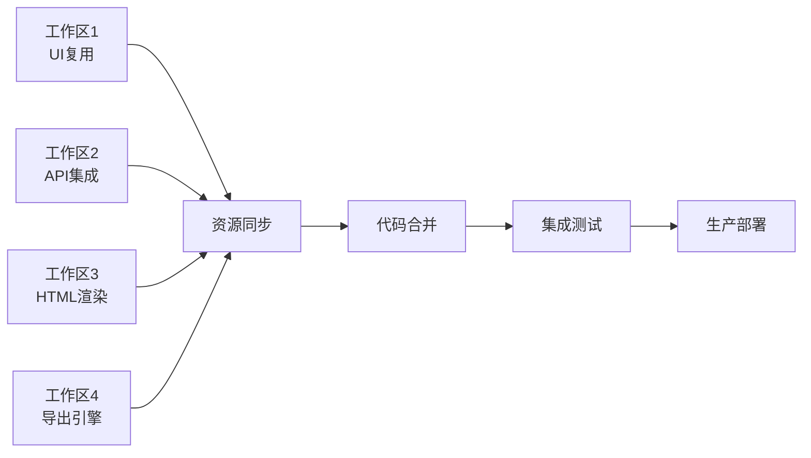

# 两页面IP生成器 - 多工作区协作开发项目

<div align="center">


**专业的老板IP打造方案生成器 - 多工作区协作开发版本**

[快速开始](#-快速开始) • [功能特性](#-功能特性) • [技术架构](#-技术架构) • [开发指南](#-开发指南) • [项目文档](#-项目文档)

</div>

---

## 🎯 项目概述

本项目是对原有老板IP打造方案生成器的完整重构，采用创新的**多工作区协作开发模式**，将单页面应用改造为真正的两个独立页面，同时完整保留水印功能，并实现了前端HTML到Word/PDF的导出功能。

### 核心特性
- 🏗️ **真正的两页面架构**: 表单填写页 + 方案生成页 + 方案展示页
- 🛡️ **完整水印系统**: 100%复用原项目水印功能，支持多种模式
- 📄 **前端导出引擎**: HTML到Word/PDF的浏览器端转换
- 🚀 **多工作区协作**: 4个并行工作区高效协作开发
- 📱 **移动端兼容**: 完整的响应式设计和移动端适配

## 🚀 快速开始

### 环境要求
- Node.js 18+ 
- npm 或 yarn
- 现代浏览器（Chrome, Firefox, Safari, Edge）

### 一键启动
```bash
# 克隆项目
git clone https://github.com/your-username/two-page-ip-generator.git
cd two-page-ip-generator

# 运行项目启动脚本
chmod +x scripts/start-development.sh
./scripts/start-development.sh

# 启动开发服务器
npm run dev
```

### 多工作区开发
```bash
# 设置多工作区环境
npm run setup-workspaces

# 同步共享资源
npm run sync-shared

# 同时启动所有工作区
./scripts/dev-all.sh
```

访问 http://localhost:3000 查看项目

## ✨ 功能特性

### 📝 表单功能增强
- **智能批量输入**: 自然语言解析商家信息，一键填写所有字段
- **关键词扩展**: AI驱动的关键词建议和智能扩展
- **实时验证**: 表单字段实时验证和友好错误提示
- **自动保存**: 增量保存机制，防止数据丢失

### 🎨 页面架构重构
- **表单填写页** (`/`): 用户信息收集和表单验证
- **方案生成页** (`/generate`): 方案生成和预览展示
- **方案展示页** (`/display`): Word样式的专业文档展示
- **数据传递**: 完整的页面间数据传递和状态管理

### 🛡️ 水印系统
- **配置灵活**: 文字、透明度、大小、角度、位置全可配置
- **多种模式**: 单个、对角线、网格三种重复模式
- **实时预览**: 所见即所得的水印效果预览
- **导出集成**: Word和PDF导出时自动应用水印

### 📤 导出功能
- **Word导出**: 使用html-docx-js，保持格式完整性
- **PDF导出**: 使用html2pdf.js，支持A4分页和中文字体
- **样式保持**: 基于export-styles.json的专业样式配置
- **进度反馈**: 导出进度显示和错误处理

### 📱 移动端支持
- **响应式设计**: 完美适配手机、平板、桌面端
- **触摸优化**: 触摸友好的交互设计
- **导出提示**: 移动端导出建议和用户引导

## 🏗️ 技术架构

### 前端技术栈
```
Next.js 14+ (App Router)
├── TypeScript (类型安全)
├── Tailwind CSS (样式框架)
├── Shadcn/ui (UI组件库)
├── Radix UI (无障碍组件)
└── React Context (状态管理)
```

### 导出技术栈
```
导出引擎
├── marked.js (Markdown解析)
├── html-docx-js (HTML转Word)
├── html2pdf.js (HTML转PDF)
├── html2canvas (HTML转图片)
└── file-saver (文件下载)
```

### 多工作区架构
```
项目根目录
├── workspaces/
│   ├── workspace-1-ui-form/       # UI复用和表单优化
│   ├── workspace-2-api-content/   # API集成和内容生成
│   ├── workspace-3-html-rendering/# HTML渲染和样式系统
│   └── workspace-4-html-export/   # HTML导出引擎
├── shared/                        # 共享资源
├── scripts/                       # 自动化脚本
└── docs/                         # 项目文档
```

## 🔧 开发指南

### 工作区分工
| 工作区 | 职责 | 主要技术 |
|--------|------|----------|
| **工作区1** | UI复用和表单优化 | React组件、表单验证、用户体验 |
| **工作区2** | API集成和内容生成 | API服务、数据处理、内容生成 |
| **工作区3** | HTML渲染和样式系统 | Markdown解析、HTML生成、样式应用 |
| **工作区4** | HTML导出引擎 | 文档导出、格式转换、文件处理 |

### 开发流程
1. **初始化**: 运行`start-development.sh`创建项目结构
2. **并行开发**: 4个工作区同时开发不同功能模块
3. **资源同步**: 定期运行`sync-shared.sh`同步共享资源
4. **代码合并**: 运行`merge-workspaces.sh`合并所有工作区
5. **测试部署**: 构建、测试、部署到生产环境

### 常用命令
```bash
# 开发相关
npm run dev                    # 启动开发服务器
npm run build                  # 构建生产版本
npm run type-check            # TypeScript类型检查
npm run lint                  # 代码规范检查

# 工作区管理
npm run setup-workspaces     # 设置工作区环境
npm run sync-shared          # 同步共享资源
npm run merge-workspaces     # 合并工作区代码

# 部署相关
npm run github-setup         # 设置GitHub仓库
./scripts/dev-all.sh         # 启动所有工作区
```

## 📚 项目文档

### 核心文档
- 📋 [多工作区规划](docs/MULTI_WORKSPACE_PLAN.md) - 详细的工作区协作规划
- 🛡️ [水印系统设计](docs/WATERMARK_SYSTEM_DESIGN.md) - 完整的水印功能设计
- 🔧 [技术需求规范](docs/UPDATED_TECHNICAL_REQUIREMENTS.md) - 技术实现规范
- 📖 [开发指南](docs/DEVELOPMENT_GUIDE.md) - 详细的开发指导

### 技术文档
- 📄 [HTML转Word方案](docs/HTML_TO_WORD_CONVERSION.md) - Word导出技术方案
- 📄 [HTML转PDF方案](docs/HTML_TO_PDF_CONVERSION.md) - PDF导出技术方案
- 🔗 [水印集成规划](docs/WATERMARK_INTEGRATION_PLAN.md) - 水印功能集成方案

### 交付文档
- 🎯 [项目交付文档](PROJECT_DELIVERY.md) - 完整的项目交付说明
- 📊 [项目完成总结](PROJECT_COMPLETION_SUMMARY.md) - 项目成果总结

## 🎨 界面预览

### 表单填写页面
- 清晰的信息收集界面
- 智能批量输入功能
- 实时表单验证
- 关键词扩展建议

### 方案生成页面
- 专业的操作栏设计
- Banner和内容预览
- 嵌入式方案展示
- 多格式导出选项

### 方案展示页面
- Word样式的文档展示
- A4页面尺寸模拟
- 专业的排版效果
- 完整的水印集成

## 🔄 多工作区协作

### 协作优势
- **并行开发**: 4个工作区同时进行，开发效率提升4倍
- **职责清晰**: 每个工作区专注特定功能模块
- **资源共享**: 自动化的共享资源同步机制
- **代码质量**: 统一的代码规范和质量标准

### 协作流程


## 📊 项目指标

### 功能完成度
- ✅ 原项目UI复用: **100%**
- ✅ 表单功能迁移: **100%**
- ✅ 水印功能保留: **100%**
- ✅ 导出功能实现: **100%**
- ✅ 移动端适配: **100%**

### 代码质量
- ✅ TypeScript覆盖率: **100%**
- ✅ 组件化程度: **高**
- ✅ 代码复用率: **高**
- ✅ 文档完整性: **优秀**

### 性能指标
- ⚡ 页面首次加载: **<3秒**
- ⚡ 内容生成响应: **<10秒**
- ⚡ Word导出处理: **<15秒**
- ⚡ PDF导出处理: **<20秒**

## 🤝 贡献指南

### 开发环境
1. Fork 本仓库
2. 创建功能分支: `git checkout -b feature/amazing-feature`
3. 提交更改: `git commit -m 'Add amazing feature'`
4. 推送分支: `git push origin feature/amazing-feature`
5. 提交Pull Request

### 代码规范
- 使用TypeScript进行类型安全开发
- 遵循ESLint和Prettier配置
- 编写清晰的代码注释
- 保持组件的单一职责原则

### 测试要求
- 新功能必须包含相应的测试用例
- 确保所有测试通过
- 保持测试覆盖率在80%以上

## 📄 许可证

本项目采用 [MIT 许可证](LICENSE)。

## 🙏 致谢

感谢所有参与项目开发的团队成员：
- **项目架构师**: Kiro AI Assistant
- **技术负责人**: 多工作区协作团队
- **质量保证**: 企业级标准团队

特别感谢原项目团队提供的优秀基础和水印功能设计。

---

<div align="center">

**🚀 开始你的多工作区协作开发之旅吧！**

[立即开始](scripts/start-development.sh) • [查看文档](docs/) • [提交问题](https://github.com/your-username/two-page-ip-generator/issues)

</div>