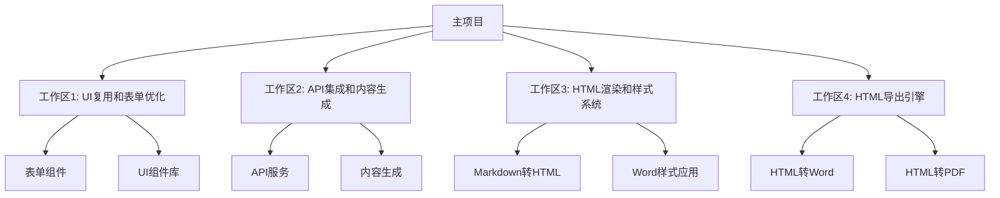

# 多工作区协作开发总体规划

## 🎯 项目目标

将原项目的老板IP打造方案生成器重构为新的两页面应用，重点实现：
1. **UI复用**: 保持原项目的浏览器展示UI
2. **表单功能**: 完整复用用户填写表单信息功能
3. **内容生成**: 保持方案生成和banner图生成逻辑
4. **格式转换**: API返回Markdown格式，转换为Word样式HTML
5. **前端导出**: HTML在浏览器端转换为Word和PDF格式

## 🏗️ 工作区架构

### 工作区分工明细



## 📋 详细任务分解

### 工作区1: UI复用和表单优化 (workspace-1-ui-form)

**🎯 核心目标**: 100%复用原项目UI，增强表单功能

**📦 主要交付物**:
```typescript
// 组件交付清单
├── components/
│   ├── enhanced-form-section.tsx      // 增强表单组件
│   ├── advanced-bulk-input.tsx        // 高级批量输入
│   ├── smart-keyword-expansion.tsx    // 智能关键词扩展
│   ├── form-validation-engine.tsx     // 表单验证引擎
│   └── ui-components-library.tsx      // UI组件库
├── hooks/
│   ├── use-form-enhancement.ts        // 表单增强Hook
│   ├── use-bulk-input-parser.ts       // 批量输入解析Hook
│   └── use-keyword-suggestions.ts     // 关键词建议Hook
└── lib/
    ├── form-validation-rules.ts       // 表单验证规则
    └── ui-theme-config.ts             // UI主题配置
```

**🔧 技术要点**:
- 从原项目复制核心UI组件
- 保持完全一致的视觉设计
- 增强表单交互体验
- 优化移动端适配

### 工作区2: API集成和内容生成 (workspace-2-api-content)

**🎯 核心目标**: 保持原项目生成逻辑，确保API返回Markdown格式

**📦 主要交付物**:
```typescript
// API服务交付清单
├── services/
│   ├── content-generation-api.ts      // 内容生成API
│   ├── banner-generation-api.ts       // Banner生成API
│   ├── api-response-adapter.ts        // API响应适配器
│   └── markdown-validator.ts          // Markdown验证器
├── hooks/
│   ├── use-content-generation.ts      // 内容生成Hook
│   ├── use-banner-generation.ts       // Banner生成Hook
│   └── use-api-integration.ts         // API集成Hook
└── lib/
    ├── api-client-config.ts           // API客户端配置
    └── response-format-handler.ts     // 响应格式处理
```

**🔧 技术要点**:
- 保持原项目的生成算法
- 确保API返回标准Markdown格式
- 实现流式内容生成
- 错误处理和重试机制

### 工作区3: HTML渲染和样式系统 (workspace-3-html-rendering)

**🎯 核心目标**: 高质量Markdown到Word样式HTML转换

**📦 主要交付物**:
```typescript
// HTML渲染交付清单
├── lib/
│   ├── markdown-to-html-converter.ts  // Markdown转HTML核心
│   ├── word-style-html-generator.ts   // Word样式HTML生成
│   ├── html-template-engine.ts        // HTML模板引擎
│   ├── style-config-parser.ts         // 样式配置解析
│   └── html-sanitizer.ts              // HTML清理器
├── components/
│   ├── html-preview-renderer.tsx      // HTML预览渲染器
│   ├── style-configuration-panel.tsx  // 样式配置面板
│   └── html-editor-component.tsx      // HTML编辑器
└── templates/
    ├── word-compatible-template.html   // Word兼容模板
    ├── pdf-optimized-template.html     // PDF优化模板
    └── style-variants.json             // 样式变体配置
```

**🔧 技术要点**:
- 基于export-styles.json配置
- 支持复杂Markdown语法
- 生成Word兼容的HTML结构
- 保持样式一致性

### 工作区4: HTML导出引擎 (workspace-4-html-export)

**🎯 核心目标**: 浏览器端HTML到Word/PDF高质量转换

**📦 主要交付物**:
```typescript
// 导出引擎交付清单
├── lib/
│   ├── html-to-word-converter.ts      // HTML转Word引擎
│   ├── html-to-pdf-converter.ts       // HTML转PDF引擎
│   ├── export-progress-manager.ts     // 导出进度管理
│   ├── export-error-handler.ts        // 导出错误处理
│   └── format-optimization.ts         // 格式优化器
├── components/
│   ├── export-dialog-component.tsx    // 导出对话框
│   ├── export-progress-tracker.tsx    // 导出进度跟踪
│   ├── format-selector-panel.tsx      // 格式选择面板
│   └── export-preview-window.tsx      // 导出预览窗口
└── services/
    ├── word-export-service.ts          // Word导出服务
    ├── pdf-export-service.ts           // PDF导出服务
    └── batch-export-service.ts         // 批量导出服务
```

**🔧 技术要点**:
- 使用html-docx-js进行Word转换
- 使用jsPDF和html2canvas进行PDF转换
- 保持格式完整性
- 优化导出性能

## 📅 开发时间线

### 第1周: 工作区初始化和基础开发
```
Day 1-2: 工作区环境设置
├── 运行setup-workspaces.sh
├── 分配工作区责任人
└── 同步共享资源

Day 3-5: 基础功能开发
├── 工作区1: UI组件复用 (60%)
├── 工作区2: API服务搭建 (50%)
├── 工作区3: Markdown解析 (70%)
└── 工作区4: 导出库集成 (40%)

Day 6-7: 第一轮集成测试
├── 基础功能联调
├── 接口对接验证
└── 问题修复
```

### 第2周: 核心功能开发
```
Day 8-10: 核心功能实现
├── 工作区1: 表单增强完成 (90%)
├── 工作区2: 内容生成完成 (85%)
├── 工作区3: HTML转换完成 (95%)
└── 工作区4: 导出功能完成 (80%)

Day 11-12: 功能优化
├── 性能优化
├── 用户体验改进
└── 错误处理完善

Day 13-14: 第二轮集成测试
├── 完整流程测试
├── 跨浏览器测试
└── 移动端适配测试
```

### 第3周: 集成和优化
```
Day 15-17: 代码合并
├── 运行merge-workspaces.sh
├── 解决合并冲突
├── 统一代码风格
└── 完整性测试

Day 18-19: 系统优化
├── 性能基准测试
├── 内存使用优化
├── 加载速度优化
└── 导出质量优化

Day 20-21: 用户验收测试
├── 功能完整性验证
├── 用户体验测试
├── 问题修复
└── 文档完善
```

### 第4周: 部署和交付
```
Day 22-24: 部署准备
├── 运行github-setup.sh
├── 配置Vercel部署
├── 环境变量设置
└── CI/CD流水线

Day 25-26: 生产部署
├── 推送到GitHub
├── Vercel自动部署
├── 生产环境测试
└── 域名配置

Day 27-28: 项目交付
├── 最终验收
├── 文档交付
├── 培训支持
└── 项目总结
```

## 🔄 合并策略

### 分阶段合并方案
```bash
# 阶段1: 基础功能合并
git checkout -b integration/phase-1
./scripts/merge-workspaces.sh workspace-1 workspace-2
npm run test
npm run build

# 阶段2: 核心功能合并
git checkout -b integration/phase-2
./scripts/merge-workspaces.sh workspace-3
npm run test
npm run build

# 阶段3: 完整功能合并
git checkout -b integration/final
./scripts/merge-workspaces.sh workspace-4
npm run test
npm run build
npm run e2e-test

# 最终合并到主分支
git checkout main
git merge integration/final
```

### 冲突解决优先级
1. **功能完整性** > 代码风格
2. **类型安全** > 运行时检查
3. **用户体验** > 开发便利性
4. **性能优化** > 代码简洁性

## 🚀 部署配置

### Vercel配置 (vercel.json)
```json
{
  "version": 2,
  "builds": [
    {
      "src": "package.json",
      "use": "@vercel/next"
    }
  ],
  "routes": [
    {
      "src": "/(.*)",
      "dest": "/$1"
    }
  ],
  "env": {
    "NODE_ENV": "production",
    "NEXT_PUBLIC_APP_URL": "https://two-page-ip-generator.vercel.app"
  },
  "functions": {
    "app/api/**/*.ts": {
      "maxDuration": 30
    }
  }
}
```

### GitHub Actions配置
```yaml
name: Multi-Workspace CI/CD
on:
  push:
    branches: [main]
  pull_request:
    branches: [main]

jobs:
  test-workspaces:
    runs-on: ubuntu-latest
    strategy:
      matrix:
        workspace: [workspace-1, workspace-2, workspace-3, workspace-4]
    steps:
      - uses: actions/checkout@v3
      - name: Setup Node.js
        uses: actions/setup-node@v3
        with:
          node-version: '18'
      - name: Test ${{ matrix.workspace }}
        run: |
          cd workspaces/${{ matrix.workspace }}
          npm test
  
  deploy:
    needs: test-workspaces
    runs-on: ubuntu-latest
    if: github.ref == 'refs/heads/main'
    steps:
      - uses: actions/checkout@v3
      - name: Deploy to Vercel
        uses: vercel/action@v20
        with:
          vercel-token: ${{ secrets.VERCEL_TOKEN }}
```

## 📊 成功指标

### 功能指标
- [ ] 原项目UI复用率 100%
- [ ] 表单功能完整迁移 100%
- [ ] Markdown到HTML转换准确率 >98%
- [ ] Word导出格式保真度 >95%
- [ ] PDF导出质量 >95%

### 性能指标
- [ ] 页面首次加载 <3秒
- [ ] 内容生成响应 <10秒
- [ ] Word导出处理 <15秒
- [ ] PDF导出处理 <20秒
- [ ] 移动端体验评分 >90

### 质量指标
- [ ] 代码测试覆盖率 >85%
- [ ] TypeScript类型覆盖率 100%
- [ ] 无严重安全漏洞
- [ ] 跨浏览器兼容性 >95%

## 🤝 协作承诺

作为项目技术负责人，我承诺：

1. **全程指导**: 为每个工作区提供技术指导
2. **代码合并**: 负责所有工作区的代码合并
3. **质量保证**: 确保合并后代码的质量和功能完整性
4. **部署管理**: 负责GitHub推送和Vercel部署
5. **问题解决**: 及时解决开发过程中的技术难题
6. **进度跟踪**: 监控各工作区开发进度
7. **最终交付**: 确保项目按时高质量交付

## 📞 联系方式

- **项目负责人**: Kiro AI Assistant
- **技术支持**: 随时在线
- **紧急联系**: 通过项目聊天群组

---

**准备好开始多工作区协作开发了吗？让我们一起创造一个高质量的产品！** 🚀